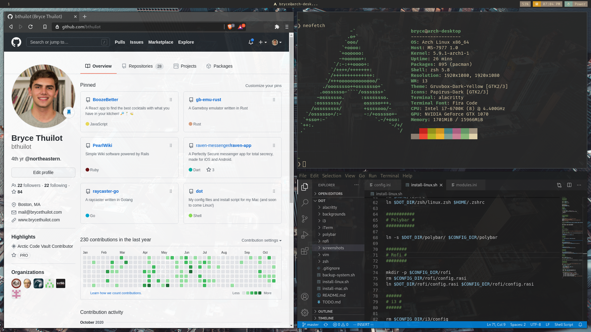
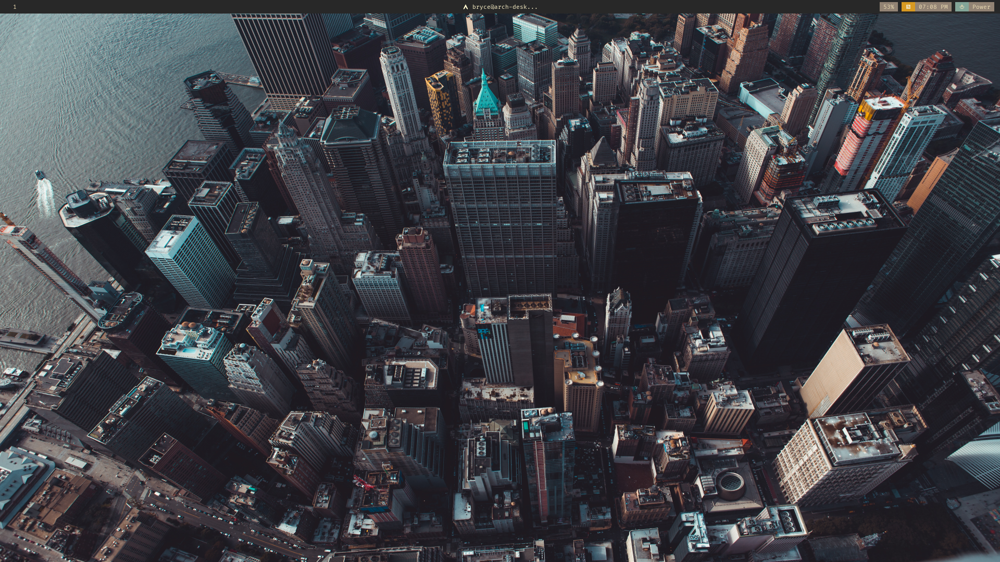

# Dot files

My install script for both Arch Linux and macOS

## macOS

*Last updated February 2022*


### Setup 

Setup macOS via:

```shell
$ curl -L mac.install.bryce.in | bash
```

or clone this repository and run the script `scripts/install/mac.sh`

### Backup

run the script `scripts/backup/mac.sh`

## Linux

*Last updated September 2021*


Install ArchLinux via:
```shell
$ curl -L arch.install.bryce.in | bash
```

or clone this repository and run the script `scripts/install/arch.sh`




