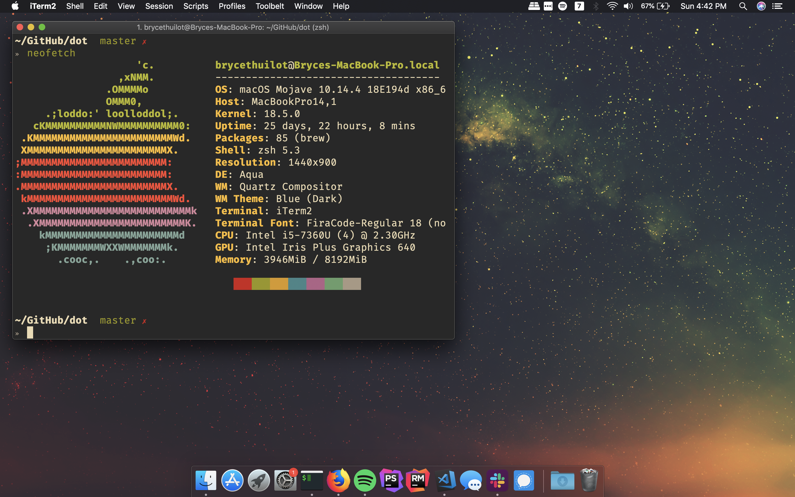

# Dot files

My install script for both Arch Linux and MacOS

## MacOS

*Last updated April 2019*

To install run `./install-mac.sh`.

Currently the scrips;
- Installs all applications listed in `install-mac.sh` 
- Installs [Homebrew](https://github.com/Homebrew/brew) 
- Changes the shell to zsh 
- Installs [oh-my-zsh](https://github.com/robbyrussell/oh-my-zsh) 
- Adds fonts listed in `fonts` directory 
- Installs my zshrc
- Installs my [neovim](https://github.com/neovim/neovim) config
- Adds my ssh-key and gpg key (if my flash drive is plugged in to the computer
- Sets my background
- Sets dark mode for mac
- Installs a given ruby version
- Sets up [iTerm2](https://github.com/gnachman/iTerm2) profile

## Linux
*Coming soon!*
